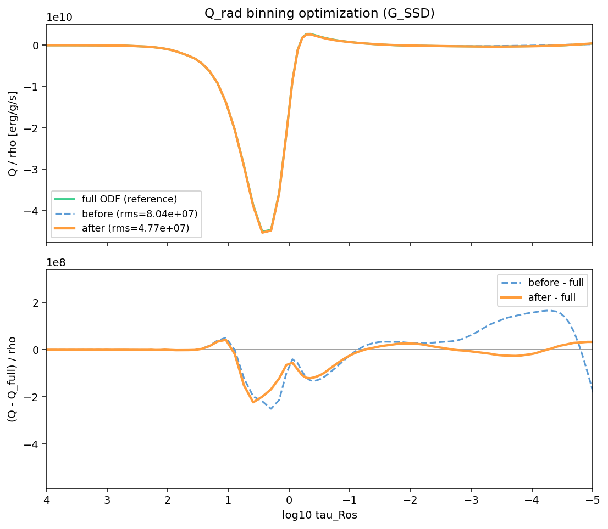
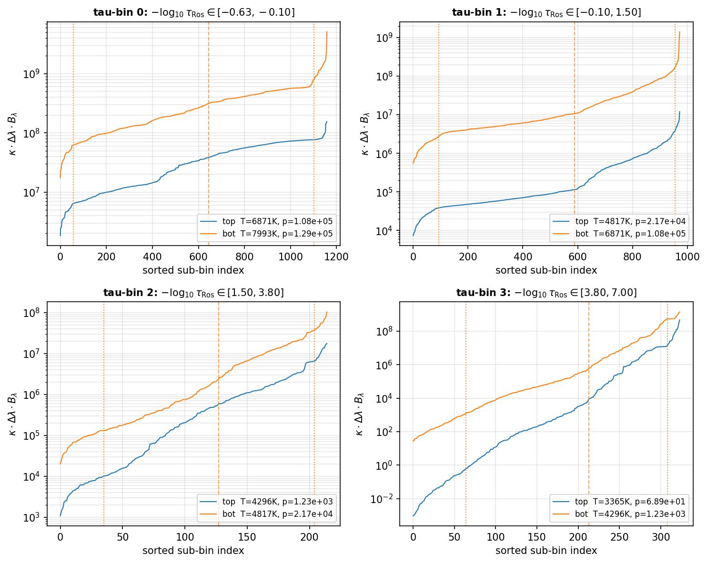
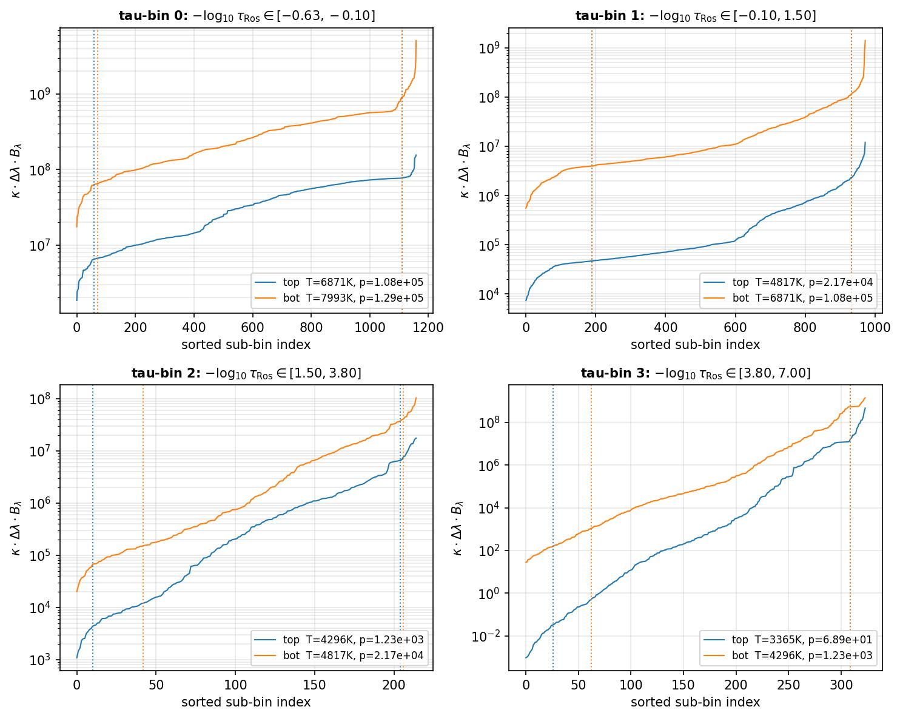
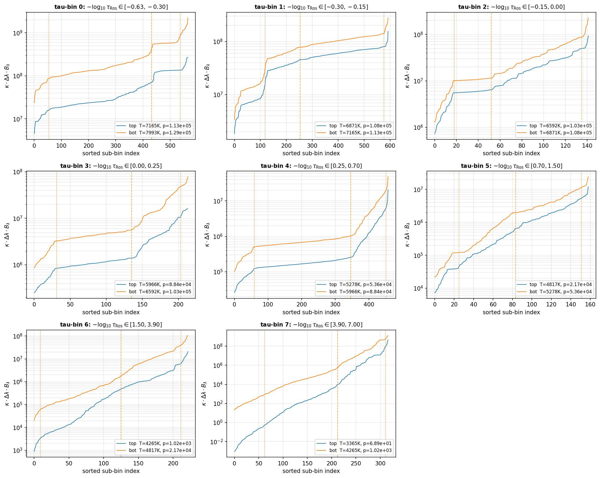
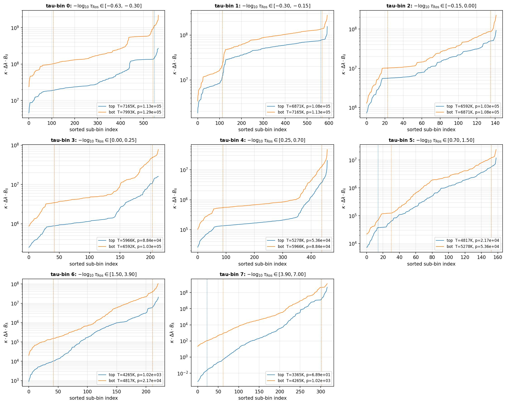
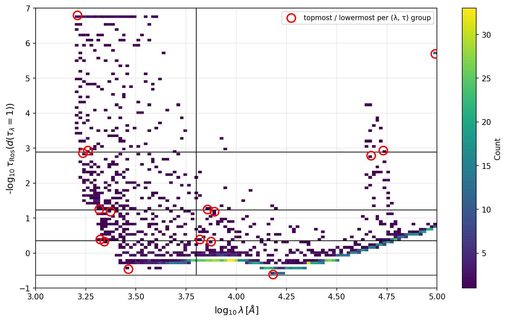
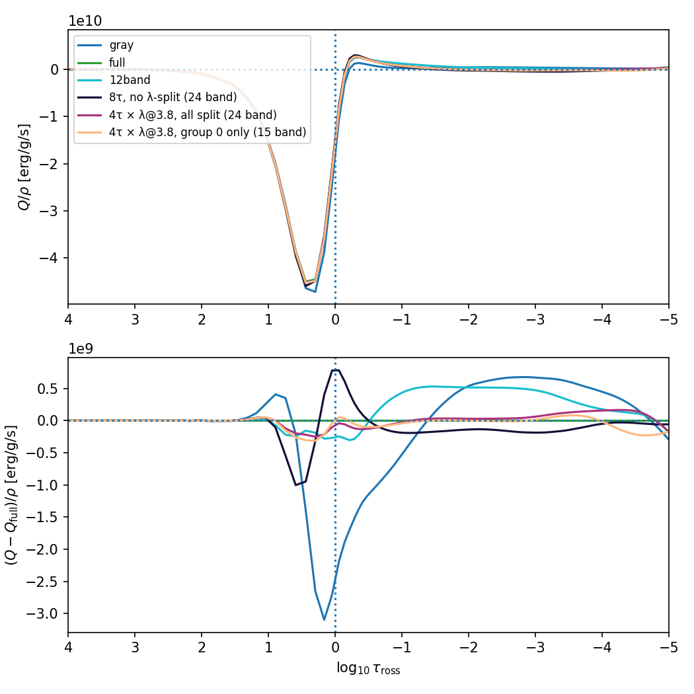

# Readme

Tau-sorting is an opacity-binning tool for stellar-atmosphere radiative transfer. It reads
opacity distribution functions (ODFs), continuum opacities and a 1D atmosphere, sorts opacity
sub-bins into tau (and optionally wavelength) groups, computes band-averaged Planck/Rosseland
mean opacities, and writes opacity tables. A companion radiative-transfer step validates those
tables by comparing the heating rate Q_rad against the full-ODF reference. The original C
implementation lives alongside the Python port.

## Setup

Python 3.12+ managed with [uv](https://docs.astral.sh/uv/) (not pip/conda):

```bash
uv sync                 # install dependencies into .venv
```

Every command below runs through `uv run` so it uses that environment.

## Usage

### 1. Generate opacity tables — `tausort.py main`

Reads `ODF_nc_format.nc`, `continuumabs.dat` and `models/G2_1D.dat` (see [Data files](#data-files))
and writes:

- `tau_bin_opacities.npy` — structured table with `planck`/`rosseland`/`mixed` each
  `[nT, nP, nBands]` (linear) plus the grouping descriptor (see `CLAUDE.md` → "Outputs").
- `kappa_<…>band_<…>.dat` — C-format binary; the filename encodes the binning, and it reads
  back with `kappa_band_reader.read_kappa_4_band_comparison`.
- diagnostics: `tau_rosseland_at_tau_lambda_one.jpg`, `sorted_weighted_opacity_per_tau_bin.jpg`,
  `height_at_tau_values.pdf`.

```bash
# Default: 8 tau-groups, single wavelength bin
uv run python tausort.py main

# Custom tau-group edges (use = so negatives aren't parsed as flags)
uv run python tausort.py main --tau-bin-edges=-0.63 --tau-bin-edges=1.5 --tau-bin-edges=7.0

# Wavelength split: every tau-group subdivides into 2 lambda cells at log10(lambda) = 3.8
uv run python tausort.py main --lambda-bin-edges 3 --lambda-bin-edges 3.8 --lambda-bin-edges 5

# Selective wavelength split: shared tau binning + a 0/1 flag per tau-group (8 groups here,
# only groups 2-5 split along lambda) -> fewer bands, spent where wavelength matters
uv run python tausort.py main --lambda-bin-edges 3 --lambda-bin-edges 3.8 --lambda-bin-edges 5 \
    --split-lambda 00111100

# Per-tau-group lambda: each tau-group gets its OWN wavelength split (its own cut, or none) --
# repeat --lambda-per-tau once per tau-group (2 edges = no split). Here 4 tau-groups cut at
# 3.82 / 3.65 / none / 3.8. This is the shape the Q_rad optimizer's per-group-lambda mode finds.
uv run python tausort.py main \
    --tau-bin-edges=-0.63 --tau-bin-edges=0.3488 --tau-bin-edges=1.2275 --tau-bin-edges=2.885 --tau-bin-edges=7 \
    --lambda-per-tau=3,3.82,5 --lambda-per-tau=3,3.65,5 --lambda-per-tau=3,5 --lambda-per-tau=3,3.8,5

# Optimize tau edges (greedy high-segment-overlap search); print only
uv run python tausort.py main --optimize-high-overlap
# ...and save the table (grows per lambda cell up to --max-bins; threshold > 1 is unreachable
# so it always grows to the cap)
uv run python tausort.py main --optimize-high-overlap --save-after-optimize --max-bins 4 \
    --high-overlap-threshold 1.01 --tau-bin-edges=-0.63 --tau-bin-edges=7.0

uv run python tausort.py main --help        # all options
```

Key flags: `--tau-bin-edges` (repeat once per edge), `--lambda-bin-edges` (log10 Å; ≥3 edges
turns on the wavelength dimension), `--split-lambda` (a 0/1 string, one digit per tau-group;
mutually exclusive with `--optimize-high-overlap`), `--lambda-per-tau` (repeat once per tau-group,
each a comma-separated edge list — per-group wavelength splits; mutually exclusive with
`--split-lambda` / `--optimize-high-overlap`), `--optimize-high-overlap` /
`--save-after-optimize` / `--max-bins` / `--high-overlap-threshold`, and
`--refine-mid/--no-refine-mid`. See [Tau-bin edge optimization and segmentation
flags](#tau-bin-edge-optimization-and-segmentation-flags) below for detail.

### 2. Validate tables — `compare_Qrad_from_kappa.py`

Computes Q_rad from each kappa table and compares against the full-ODF reference (full detail in
[Radiative-transfer Q_rad comparison](#radiative-transfer-q_rad-comparison) below):

```bash
uv run python compare_Qrad_from_kappa.py        # writes Qrad_comparison.png
```

### 2b. Interactive explorer — `webapp/`

A small local web app to play with the τ / λ bin edges (and per-τ-group λ-split flags) and see the
effect on Q_rad live, instead of regenerating tables by hand. It precomputes the expensive,
edge-independent work once at startup, then each edge change re-runs only the cheap
binning + RTE (~3 s):

```bash
uv run python webapp/server.py        # then open the printed http://localhost:<port>
```

**Deploy via a local `.venv` + `make`.** For a long-running instance, install the deps into a
project-local `.venv` once and manage the server with the Makefile (it runs
`.venv/bin/python webapp/server.py` detached, writes the PID to `.webapp.pid`, and logs to
`webapp.log`):

```bash
uv sync            # create ./.venv and install dependencies
make start         # start the server in the background  -> http://localhost:8771
make status        # is it running?
make stop          # stop it
make restart       # stop + start
```

`make start` is idempotent (it won't double-start) and the first start reads the ODF (~10–30 s)
before it begins serving; watch progress with `tail -f webapp.log`. The data inputs must be present
in the repo for the server to precompute: `models/G2_1D.dat` (the 1D atmosphere, tracked),
`ODF_format.npy` (or `ODF_nc_format.nc`), `continuumabs.dat`, and the two reference tables
`data/kappa_grey.dat` (gray → the log₁₀ τ_Ross axis) and `data/kappa_fullodf.dat` (full-ODF → the
Q_full residual baseline). (`data/kappa_12_band.dat` and `kappa_*band_*.dat` are only used by
`compare_Qrad_from_kappa.py`, not the server.)

**Model atmosphere.** Both the binning *and* the radiative transfer run on the model picked in the
**Model atmosphere** dropdown (default `models/G2_1D.dat`). The dropdown lists every *validated* 1D
model in `models/`; drop more files in that folder and hit **Refresh** to re-scan. The report under
the dropdown flags every file that *fails* validation and says why — a usable model is an ASCII table
with 4 columns (z, ρ, p, T), ≥2 rows, and a strictly **decreasing** height column z (top of the
atmosphere first). A model's first use precomputes (~10–30 s, then cached); switching back is instant.

Type τ-edges and λ-edges, toggle which τ-groups split along λ, and the plot updates live. Three
stacked panels:

- **Binning diagram** (top) — the same view as `tau_rosseland_at_tau_lambda_one.jpg`: every
  wavelength sub-bin plotted at (log₁₀ λ, −log₁₀ τ_Ros(τ_λ=1)), colored by which (λ, τ) group it
  lands in, with the group boxes drawn on top. Shows *how the current edges carve up the sub-bins*.
- **Q/ρ** (middle) and **residual vs full ODF** (bottom), with the rms / max / ∫Q metrics. The
  references plotted are **full ODF** (the baseline) and **gray**; if you place a table at
  `data/kappa_goldenS.dat` (e.g. `ln -s kappa_12_band.dat data/kappa_goldenS.dat`) a **goldenS**
  curve is added too — a fixed "known-good" binning to compare your table against. It's optional:
  when the file is absent it's simply not shown.

**Optimize τ edges** runs the greedy high-overlap optimizer (same as
`tausort.py main --optimize-high-overlap`): it grows to *N* optimally-placed τ groups over the
whole λ range, fills the τ box, and recomputes — a one-click way to get good edges to start from.
(It maximizes high-segment *overlap*, a binning-quality proxy, so more groups need not lower the
Q_rad residual — the tool lets you see that.)

**Optimize for Q_rad** runs the direct optimizer (§2c) as a background job, warm-started from the
current binning: tick which of τ / λ / flags / grow-N to vary, set a time budget, and watch the rms
tick down live (with a **cancel** that keeps the best binning found so far). When it finishes it
loads the optimized edges + flags and recomputes. This minimizes the residual *directly*, so it
typically beats the high-overlap button — at the cost of a full RTE solve per step (~2.5 s).

Tick **per-group λ** to let *each τ group choose its own wavelength split* (its own cut position, or
none) instead of one shared cut + on/off flags. The binning diagram then shows the λ cuts "jumping"
per τ band; a summary lists each group's cut. (Editing the τ/λ boxes by hand reverts to shared-λ.)

**Download kappa table (.dat)** writes the *current* binning's C-format kappa table (self-describing
name, e.g. `kappa_24band_...dat`) — after an optimize run that's the optimized table, per-group λ
included. It streams the file to your browser without touching the repo.

Needs the same inputs as `compare_Qrad_from_kappa.py` (the `data/` reference tables + `models/G2_1D.dat`).
Pure stdlib server (no extra dependencies).

### 2c. Q_rad-driven optimizer — `qrad_optimize.py`

The webapp's "Optimize τ edges" button and `tausort.py main --optimize-high-overlap` both maximize
a *proxy* (per-group high-segment overlap). This optimizer instead **minimizes the Q_rad rms
residual directly** — the metric that actually matters — searching over the τ edges, the λ-cell
edge positions, the per-τ-group split flags, and (optionally) the number of τ groups, on the single
atmosphere `models/G2_1D.dat`:

```bash
# reposition the 4 τ edges to minimize the single-cell rms (fast, ~5 min)
uv run python qrad_optimize.py \
    --tau-bin-edges=-0.63 --tau-bin-edges=0.35 --tau-bin-edges=1.23 --tau-bin-edges=2.885 --tau-bin-edges=7 \
    --lambda-bin-edges 3 --lambda-bin-edges 5 --no-opt-lambda --no-opt-flags --no-grow

# full scope: also move λ edges, flip split flags, and grow the τ-group count (~20-30 min)
uv run python qrad_optimize.py \
    --tau-bin-edges=-0.63 --tau-bin-edges=0.35 --tau-bin-edges=1.23 --tau-bin-edges=2.885 --tau-bin-edges=7 \
    --lambda-bin-edges 3 --lambda-bin-edges 3.8 --lambda-bin-edges 5 --split-lambda 1111 \
    --grow --max-seconds 1500 --save-plot plots/qrad_before_after.png

# per-group λ: each τ group picks its own wavelength split (its own cut, or none)
uv run python qrad_optimize.py \
    --tau-bin-edges=-0.63 --tau-bin-edges=0.35 --tau-bin-edges=1.23 --tau-bin-edges=2.885 --tau-bin-edges=7 \
    --lambda-bin-edges 3 --lambda-bin-edges 5 --per-group-lambda --max-seconds 300
```

Search is **block-coordinate**: alternate coordinate descent on τ edges, greedy split-flag flips,
and coordinate descent on λ edges to a fixed point, then optionally grow the τ-group count (a new
edge is accepted only if rms improves past a tolerance). Each evaluation is a full RTE solve
(~2.5 s via the shared `qrad_core.score_binning`), so it is a **run-and-wait / batch tool**, bounded
by `--max-evals` / `--max-seconds`; it logs progress and prints the before/after rms + edges + flags.
Guardrails keep edges strictly increasing and above a per-axis min-gap, and an empty-band penalty
stops the search from collapsing groups. Toggle blocks with `--no-opt-tau/--no-opt-lambda/--no-opt-flags/--no-grow`;
pick the objective with `--metric rms|maxabs|int_q` and the position search with `--method cd|nm`
(Nelder-Mead over a monotone reparameterization).

With `--per-group-lambda`, the shared cut + flags are replaced by a **per-τ-group** λ binning: for
each τ group the search keeps the better of *no split* or a *single λ cut* (its position optimized),
so the wavelength split can differ (or be absent) per τ group — the "jumping" cuts. It prints each
group's cut and (with `--save-plot`) the before/after.

Add `--save-dat` to write the optimized binning's **kappa `.dat` table** when the run finishes
(`qrad_core.save_kappa_dat` → `tausort.build_kappa_band_comparison` / `write_kappa_4_band_comparison`);
the filename encodes the binning (per-group λ included, via the `--lambda-per-tau` naming). This is
the direct way to materialize the optimized table without re-running `tausort.py main`.

The full-scope run above tightens the residual noticeably — trading the uniform 4×2 split for
fewer, better-placed τ groups and a smarter split pattern — and beats the high-overlap proxy on the
metric that matters. Before/after on `models/G2_1D.dat`:



### 3. Utility & plotting scripts

| Command | Reads | Writes / does |
| --- | --- | --- |
| `uv run python tausort.py verify-planck` | — | `planck_verification.pdf` (Planck function + derivative checks) |
| `uv run python planck.py` | — | Planck function / derivative verification plot |
| `uv run python plot_atmosphere.py` | `G2_1D.dat` | `atmosphere_profiles.jpg` (height / ρ / p / T profiles) |
| `uv run python plot_odf_samples.py` | `ODF_nc_format.nc` | `odf_samples.png` (sample ODF curves) |
| `uv run python plot_kap_mean_grid.py --input <kappa.dat> [--comparison tau_bin_opacities.npy]` | a kappa `.dat` (+ optional `.npy`) | `kap_mean_grid_4x3.png` (band-mean opacity grid) |
| `uv run python tausort.py convert-odf ODF_nc_format.nc ODF_format.npy` | ODF NetCDF | `ODF_format.npy` (the fast cache `main` reads; also available standalone as `convert_odf_to_npy.py -i … -o …`) |
| `uv run python tausort.py convert-continuum continuumabs.dat continuumabs.npy` | `continuumabs.dat` | `continuumabs.npy` (the fast cache `main` reads; ~75× faster than the ASCII `.dat`) |
| `uv run python group_derivatives.py <grouped-column-file>` | a grouped column file | opacity-group derivative / segmentation analysis |

`rte.py` (RT solver) and `kappa_band_reader.py` (C-binary read/write) are libraries imported by
the scripts above — no CLI of their own.

### 4. C reference implementation

```bash
make            # builds tausort.x from tausort.c / global_tau.h
make clean
```

`diff_binning/` holds alternative `global_tau.h` configs for different bin counts.

### 5. Tests & dev

```bash
uv run python -m unittest test_build_split_band_index test_kappa_dat_export \
    test_kappa_band_reader test_plot_kap_mean_grid
uv run python test_derivatives.py     # quick script, not unittest-based
./scripts/precommit.sh                # ruff format + check + whitespace (run before committing)
```

## Data files

Most data inputs are **gitignored** (large / not ours to redistribute), so a fresh clone does **not**
include them. What ships with the repo: the code and `models/G2_1D.dat` (the single 1D atmosphere the
binning *and* the radiative transfer run on).

**Required after cloning** — put these in place (repo root, and `data/`) before running the tools:

| File | Needed for | What it is |
| --- | --- | --- |
| `ODF_nc_format.nc` **or** `ODF_format.npy` | everything | ODF opacity-distribution table (`.npy` is a faster cache of the `.nc`, made by `convert_odf_to_npy.py`; either works) |
| `continuumabs.dat` | everything | continuum opacity |
| `data/kappa_grey.dat` | explorer / optimizer / `compare_Qrad_from_kappa.py` | gray reference → the log₁₀ τ_Ross axis |
| `data/kappa_fullodf.dat` | explorer / optimizer / `compare_Qrad_from_kappa.py` | full-ODF reference → the Q_full residual baseline |
| `data/kappa_12_band.dat` | `compare_Qrad_from_kappa.py` only | a plotted 12-band reference case |

So the interactive explorer / `qrad_optimize.py` need **four** of these: the ODF, `continuumabs.dat`,
`data/kappa_grey.dat`, `data/kappa_fullodf.dat`. (Build the fast `.npy` caches once with
`tausort.py convert-odf ODF_nc_format.nc ODF_format.npy` and
`tausort.py convert-continuum continuumabs.dat continuumabs.npy`.) Already tracked
(comes with the clone): `models/G2_1D.dat`. Not used by the current pipeline: `continuumscat.dat` / `continuumall.dat`
(only `continuumabs.dat` is read). The `kappa_*band_*.dat` tables that `compare_Qrad_from_kappa.py`
also plots are *generated* by `tausort.py main`, not provided.

The tree below documents the full set of inputs:

```
├── models/G2_1D.dat           - 1D atmospheric model data (height - descending, density, pressure, temperature)
├── Makefile                   - Makefile to compile the c version tau-sorting code
├── ODF_nc_format.nc           - ODF data in netCDF format (p, T, n_bins, n_subbins)
├── continuumabs.dat           - Continuum absorption data (p, T, n_bins)
├── continuumscat.dat          - Continuum scattering data
├── continuumall.dat           - Continuum absorption + scattering data
├── diff_binning               - ignored directory
│   ├── global_tau.h_12bins
│   ├── global_tau.h_15bin
│   ├── global_tau.h_2bins
│   ├── global_tau.h_4bins
│   └── global_tau.h_grey
├── global_tau.h               - Header file with global variables for tau-sorting
├── p00big3.bdf                - Line absorption data file
└── tausort.c                  - C source code for tau-sorting
```

```
❯ ncdump -h ODF_nc_format.nc
netcdf ODF_nc_format {
dimensions:
	np = 150 ;                            - number of pressure points
	nt = 300 ;                            - number of temperature points
	nbins = 328 ;                         - number of lambda bins
	nsubbins = 12 ;                       - number of sub-bins per lambda bin
	numfp = 329 ;                         - number of lambda edges (lambda!!)
variables:
	short ODF(nt, np, nbins, nsubbins) ;  - ODF values as short integers - float value = 10^(ODF/1000)
	double FreqG(numfp) ;
	double P(np) ;
	double T(nt) ;
	double subbin(nbins, nsubbins) ;

// global attributes:
		:vturb = 2. ;
}
```

## Python implementation

### Overview

1. Inputs:
    - ODF_nc_format.nc - kappa (T, p, N_b, N_s)
    - continuumall.dat - continuum opacity (T, p, N_b)
    - models/G2_1D.dat - atmospheric model (height, rho, p, T)
2. Calculate reference kappa (rosseland, 500nm...) as
    $$ \kappa_\text{all}(T,p) = f(\kappa_{ODF} + \kappa_{cont}) $$
    $$ \kappa_\text{ross} = \frac{\integrate_0^\inf\kappa_\text{all} \frac{dB_\lambda}{dT} d\lambda}{\integrate_0^\inf \frac{dB_\lambda}{dT} d\lambda} $$
3. Interpolate kappa calcualted on the T,p grid from ODFs to the T,p grid of the atmospheric model

## Tau-bin edge optimization and segmentation flags

`tausort.py main` exposes a small number of new CLI flags that control how
the tau-bin edges are chosen and how the per-bin sorted-opacity curves are
segmented.

### `--optimize-high-overlap` / `--high-overlap-threshold`

```
--optimize-high-overlap         (default: off)
--high-overlap-threshold FLOAT  (default: 0.70)
```

When `--optimize-high-overlap` is passed, the tool runs a greedy optimizer
over `--tau-bin-edges` instead of producing the usual per-tau-bin plot.

The optimizer:

1. Computes the *high segment* (large-tau tail of the sorted-opacity curve)
   overlap for every bin defined by the current edge list.
2. While any bin has a high-segment overlap below `--high-overlap-threshold`,
   the optimizer greedily adjusts an existing edge — or inserts a new one —
   to lift the worst-offending bin above the threshold.
3. Iteration stops once every bin clears the threshold (or the cap of
   8 bins is reached). The final edge list and per-bin overlap table are
   printed and the tool exits **before** the sorted-opacity plot is written.

Use the optimizer to *find* good edges, then re-run with the printed
`--tau-bin-edges ...` (no `--optimize-high-overlap`) to actually produce
the sorted-opacity plot.

### `--refine-mid` / `--no-refine-mid`

```
--refine-mid     (default)
--no-refine-mid
```

This flag is forwarded straight to `analyze_group` (in
`group_derivatives.py`) which segments each bin's sorted-opacity curve
into `low / mid / high` (and optionally `mid1 / mid2`) pieces.

* With `--refine-mid` (default), `analyze_group` runs
  `iterative_refine_breaks`, which can split the middle segment in two by
  setting `seg["split_mid"] = True` and choosing a `seg["b_mid"]` index.
  When that happens, `plot_sorted_weighted_opacity_per_tau_bin` draws an
  additional dashed vertical line at `b_mid` for that bin.
* With `--no-refine-mid`, `iterative_refine_breaks` is skipped, so
  `seg["split_mid"]` stays `False`, no `b_mid` is computed, and no
  `b_mid` line is drawn — only the outer `b1` and `b2` break lines remain.

The `compute_bot_segment_overlap_per_tau_bin` table also reflects the
choice: with `--refine-mid` the `mid` row may be replaced by separate
`mid1` and `mid2` rows.

## Sorted-opacity plots

Four representative `sorted_weighted_opacity_per_tau_bin` runs are committed
in `plots/`. All four use explicit `--tau-bin-edges` (no optimizer), so the
sorted-opacity plot is produced; the only differences are the number of
tau-bins and whether `--refine-mid` is on or off.

| Plot | Bins | `refine-mid` |
| --- | --- | --- |
| `plots/sorted_4bin_refinemid.jpg` | 4 | on (default) |
| `plots/sorted_4bin_no_refinemid.jpg` | 4 | off |
| `plots/sorted_8bin_refinemid.jpg` | 8 | on (default) |
| `plots/sorted_8bin_no_refinemid.jpg` | 8 | off |



*4 tau-bins, `--refine-mid`: the middle segment of each bin is allowed to
split, so a dashed `b_mid` line appears wherever `iterative_refine_breaks`
finds a better 4-segment (low / mid1 / mid2 / high) fit.*



*4 tau-bins, `--no-refine-mid`: same edges, but `split_mid` is forced
`False` for every bin, so only the outer `b1` and `b2` break lines are
drawn and the middle segment is a single piece.*



*8 tau-bins (edges from a previous `--optimize-high-overlap` run), with
mid-segment refinement enabled. With more, narrower tau-bins the
sorted-opacity curves are flatter, but several still benefit from a
`b_mid` split.*



*8 tau-bins, `--no-refine-mid`: the same 8-bin edges, but with no
mid-segment refinement; useful as a baseline for comparing the segmentation
quality against the refined version above.*

### Reproducing the plots

```bash
# 4 tau-bins, refine-mid (default)
uv run python tausort.py main \
  --tau-bin-edges -0.63 --tau-bin-edges -0.1 --tau-bin-edges 1.5 \
  --tau-bin-edges 3.8 --tau-bin-edges 7.0 \
  --refine-mid

# 8 tau-bins, no-refine-mid
uv run python tausort.py main \
  --tau-bin-edges -0.63 --tau-bin-edges -0.3 --tau-bin-edges -0.15 \
  --tau-bin-edges 0.0  --tau-bin-edges 0.25 --tau-bin-edges 0.7 \
  --tau-bin-edges 1.5  --tau-bin-edges 3.9  --tau-bin-edges 7.0 \
  --no-refine-mid
```

Each run writes `sorted_weighted_opacity_per_tau_bin.jpg` to the CWD;
rename/move it into `plots/` to reproduce the files above.

## Radiative-transfer Q_rad comparison

`compare_Qrad_from_kappa.py` validates the binned-opacity tables by computing the
radiative heating rate Q_rad from each table and comparing it against the full-ODF
reference. It is **self-contained** in this repo — the RT solver (`rte.py`) and the
1D atmosphere (`models/G2_1D.dat`) live here, no external dependencies.

```bash
uv run python compare_Qrad_from_kappa.py
```

For each opacity table it:

1. reads the table with `kappa_band_reader.read_kappa_4_band_comparison`,
2. interpolates `ln κ` / `ln B` onto the 1D atmosphere (`models/G2_1D.dat`),
3. solves the 1D RTE per band (short characteristics, `rte.Solver`),
4. sums the per-band heating rate to Q_rad and plots `Q/ρ` and the residual
   `(Q − Q_full)/ρ` vs `log10 τ_ross`, writing `Qrad_comparison.png`.

Inputs it expects (all gitignored — provide or regenerate them):

- `data/kappa_grey.dat`, `data/kappa_fullodf.dat`, `data/kappa_12_band.dat` — the
  gray / full-ODF / C-12-band reference tables (full-ODF is the residual baseline).
- `kappa_<…>band_…_lam_….dat` in the repo root — any tables emitted by
  `tausort.py main`; they are auto-discovered and labelled by their binning
  (`tg…` single-cell, `lm…_tg…` per-cell λ-split, `lm…_sl…` split-flag).

Restrict/relabel the plotted cases via the `SELECT` / `LABELS` lists near the top of
the script (empty `SELECT` plots gray, full, 12band, and every discovered table).

### Worked example: how the binning choice affects Q_rad

**What we'll do.** Bin the opacity three ways at (roughly) the same band budget, then check
which best reproduces the radiative heating rate Q_rad against the full-ODF line-by-line
reference:

| binning | groups | bands |
| --- | --- | --- |
| 8 τ-groups, no wavelength split | 8 τ × 1 λ | 24 |
| 4 τ-groups, **all** split in λ at log₁₀λ = 3.8 | 4 τ × 2 λ | 24 |
| 4 τ-groups, **only the first** split in λ | (3 τ × 1 λ) + (1 τ × 2 λ) | 15 |

The two 24-band tables let us ask "spend the budget on τ depth, or on wavelength?", and the
15-band one asks "do we even need to split every τ-group?". (The 4-group τ-edges below were
found earlier with `--optimize-high-overlap`; you can also let the optimizer pick them.)

**Commands.**

```bash
# 1) reference binnings + the three tables under test (each writes a kappa_*.dat)
uv run python tausort.py main                          # 8 tau-groups, no lambda split (24 band)

TAU4="--tau-bin-edges=-0.63 --tau-bin-edges=0.3488 --tau-bin-edges=1.2275 --tau-bin-edges=2.885 --tau-bin-edges=7.0"
LAM="--lambda-bin-edges 3 --lambda-bin-edges 3.8 --lambda-bin-edges 5"

uv run python tausort.py main $TAU4 $LAM --split-lambda 1111   # 4 tau x 2 lambda, all split (24 band)
uv run python tausort.py main $TAU4 $LAM --split-lambda 1000   # split only group 0   (15 band)

# 2) compare Q_rad (needs data/kappa_grey.dat, kappa_fullodf.dat, kappa_12_band.dat as references).
#    The shipped SELECT/LABELS in compare_Qrad_from_kappa.py already pick exactly these cases.
uv run python compare_Qrad_from_kappa.py               # writes Qrad_comparison.png
```

Each `tausort.py main` run also writes `tau_rosseland_at_tau_lambda_one.jpg` — the binning
diagram below is the one from the `--split-lambda 1111` run.

**The binning.** Each sub-bin is placed by its wavelength (x) and the Rosseland optical depth
reached where that sub-bin becomes optically thick (y). Horizontal lines are the shared τ-group
edges; the vertical line is the λ cut at log₁₀λ = 3.8; red circles mark the topmost/lowermost
member of each (λ, τ) group.



**The effect on Q_rad.** Top: total `Q/ρ` (all binnings reproduce the photospheric cooling
peak). Bottom: residual vs the full-ODF reference — this is what matters.



Reading the residual panel (rms over log₁₀τ ∈ [−5, 4], lower is better). *The absolute rms values and
the `qrad_comparison.png` residual plot were produced on the STAGGER solar model that supplied the RTE
atmosphere at the time; the RTE now runs on `models/G2_1D.dat`, so re-run the commands for exact
figures — the **relative** ordering (the takeaway) is atmosphere-robust:*

| binning | bands | rms `ΔQ/ρ` | vs full |
| --- | --- | --- | --- |
| gray (1 Rosseland mean) | 1 | 6.9e8 | −3e9 trough at the cooling peak |
| C 12-band reference | 12 | 2.8e8 | broad bias in the upper atmosphere |
| 8 τ, no λ-split | 24 | 2.1e8 | ±1e9 swing right at τ ≈ 1 |
| 4 τ × λ, all split | 24 | **8.0e7** | hugs zero everywhere |
| 4 τ × λ, group 0 only | 15 | 8.3e7 | as good as all-split, 9 fewer bands |

Takeaways: at the same 24-band budget, splitting in **wavelength** (4 τ × 2 λ) beats spending
it all on τ depth (8 τ) by ~2.5× in rms; and the split only pays off in the
**sub-photospheric** τ-group (group 0, τ ≈ 0.4–4) where the cooling peak forms — splitting only
that one group recovers nearly the full benefit at 15 bands. That is exactly what
`--split-lambda` is for: spend wavelength resolution only where it matters.

Relevant files: `compare_Qrad_from_kappa.py` (driver), `rte.py` (RT solver),
`models/G2_1D.dat` (the 1D atmosphere).
